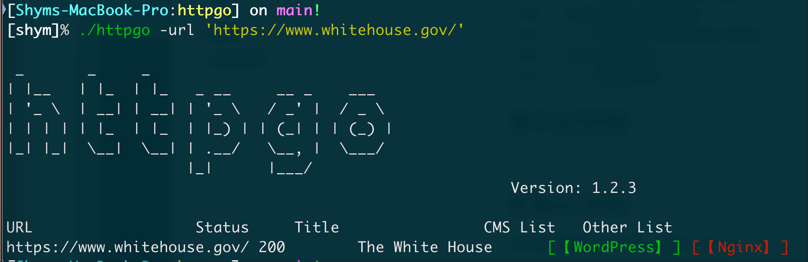
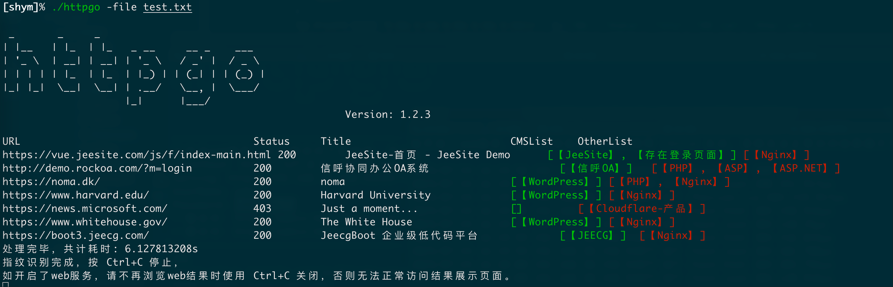
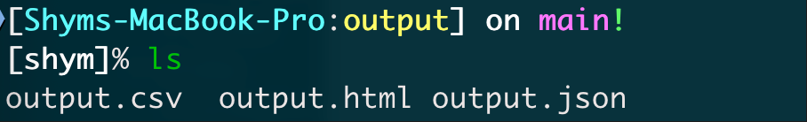
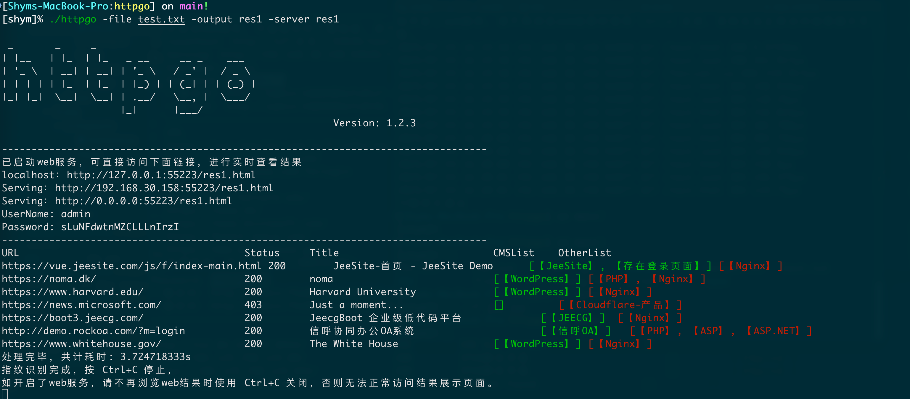
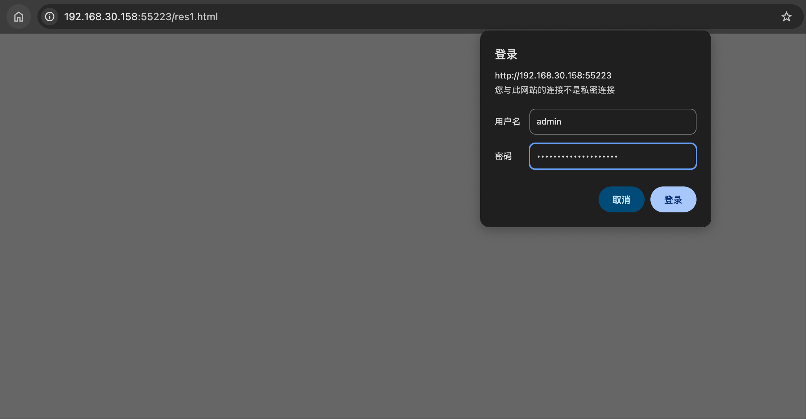
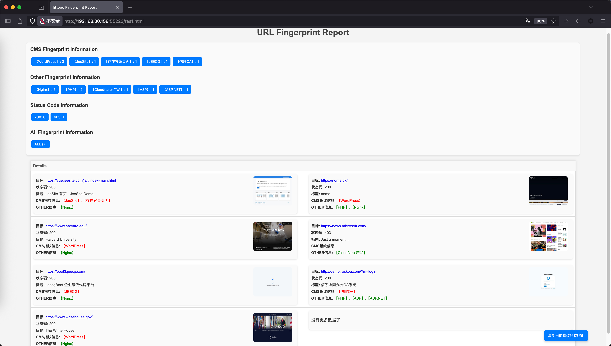
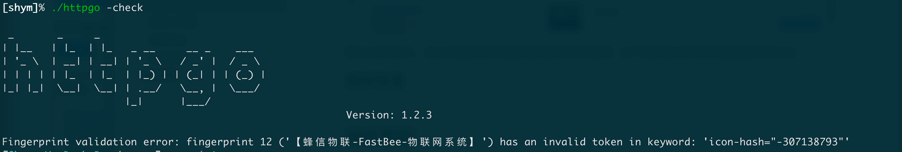
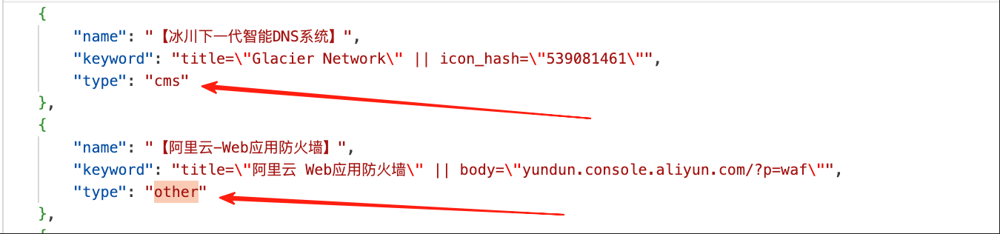
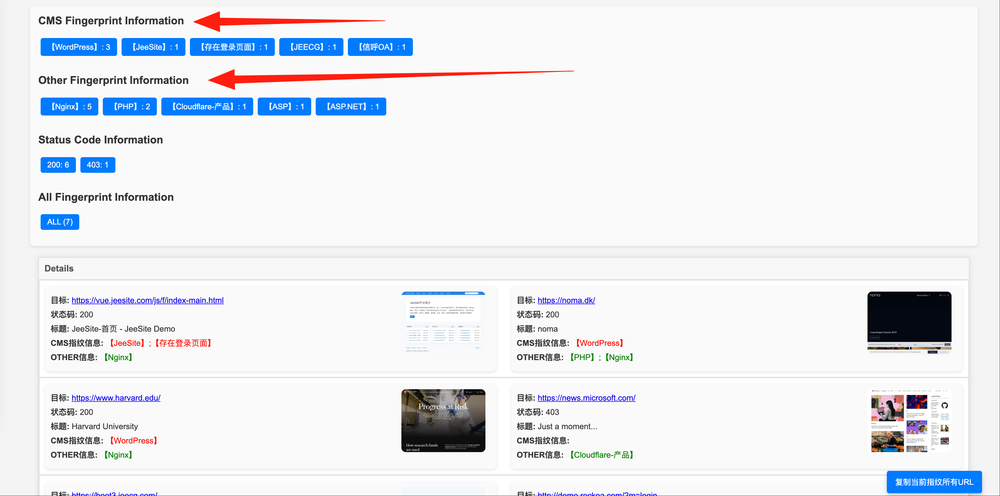

# httpgo

## 关于
httpgo是一个web指纹识别工具，支持多线程、HTTP代理、批量识别、保存结果、截图展示。可自行添加指纹。

## 使用
### 单个url识别

~~~
[shym]% ./httpgo -file 'https://www.whitehouse.gov/'
~~~

### 批量url识别

~~~
[shym]% ./httpgo -file test.txt
~~~

如不指定-outfile ，结果则默认保存在output文件夹下，自动保存格式为3种

### 推荐用法

-file 要批量识别的url的文件

-output 为保存结果的路径

-server 开启保存结果路径的web服务（会默认添加20位随机的密码，防止未授权）

~~~
[shym]% ./httpgo -file test.txt -output res1 -server res1
~~~

运行后即可实时查看指纹结果页面，输入账号密码即可

图片点击可放大，点击对应指纹即可查看当前指纹的所有结果，右下角按钮点击可复制当前指纹的所有URL

还可以直接访问web的根路径，下载其他格式的指纹结果文件。

### 指纹json检查

检查新添加的指纹是否存在格式错误，添加指纹后可以尝试允许，防止写错。

~~~
./httpgo -check
~~~

## 指纹规则

~~~
title="xxxxx" 匹配title的内容
header="Server: bbbb"	匹配响应标头Server的内容
icon_hash="1111111"	匹配favico.ico图标hash内容
body="cccc"	匹配body中的内容
cert="dddd"	匹配证书中内容
body="xxxx" && header!="ccc" 匹配body中包含xxxx并且header中不包含ccc的内容

=为包含关系，即包含关系即可匹配
!=为不包含关系，即不包含关系即可匹配

支持逻辑 && 以及 || 和 ()比如
body=\"aaaa\" && (title=\"123\" || title=\"456\")

双引号"记得转义，如果是搜索的具体内容里有"需要在"前加\\\",如
body=\"<link href=\\\"/jcms/\" 匹配的为body中是否包含<link href="/jcms/

{
  "name": "jcms or fcms",
  "keyword": "body=\"<link href=\\\"/jcms/\" || body=\"<link href=\\\"/fcms/\" || body=\"jcms/Login.do\" || body=\"fcms/Login.do\""
}

如果是搜索的具体内容里有&或|需要在他们前面使用\\,如
body=\"1234\\&\\&1111\" 匹配的为body中是否包含1234&&1111
~~~

指纹目前仅分了两种类型一类是cms，一类是other，方便在web中区分重点。

